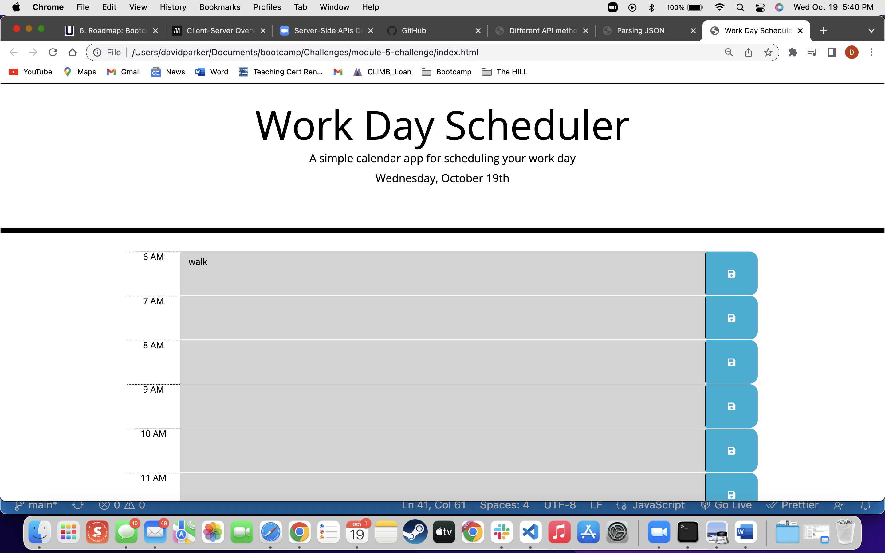
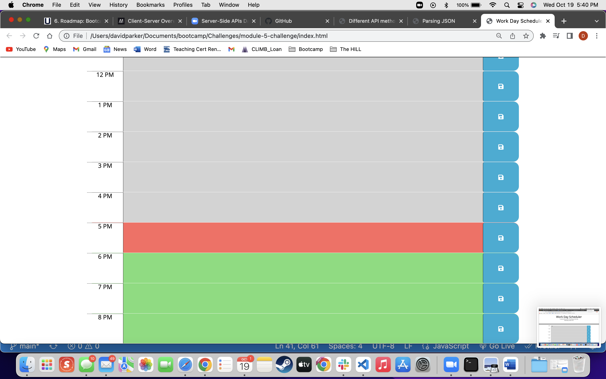
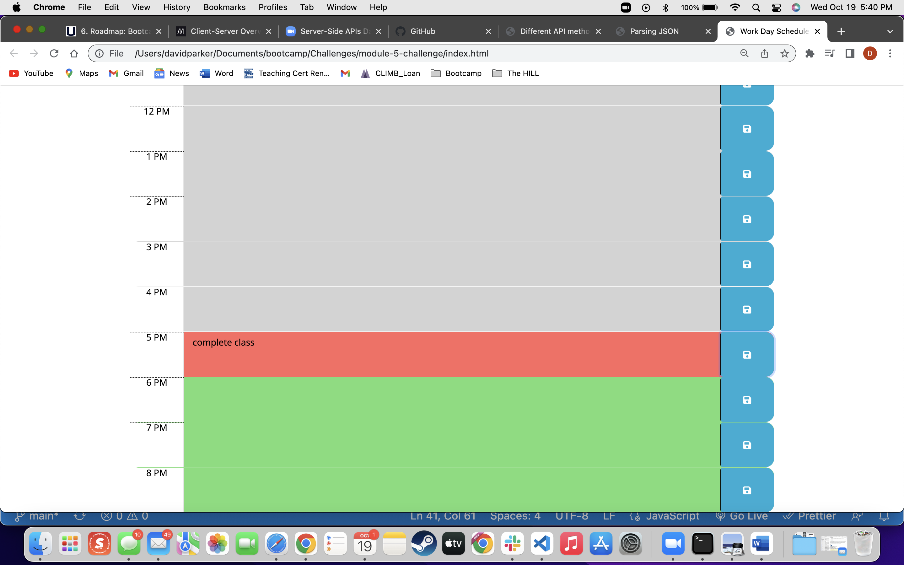

# Third-Party APIs: Work Day Scheduler
  Third-Party APIs: Work Day Scheduler
  
  ## Table of Contents
  1. [Description](#description)
  2. [Email](#email)
  3. [Application Type](#application-type)
  4. [Github repository link](#github-repository-link)

  ## Description
This is a calendar application that allows you to be able to save events for each hour of their own day. It allows for the visualization of what hours are left in the day with the use of colors and allows for you to schedule an event within the planner. 

 

  ## Email
  david.m.parker92@gmail.com

  ## Application Type
  Third-Party APIs

  ## Github repository link
  https://github.com/DavidParker42/module-5-challenge